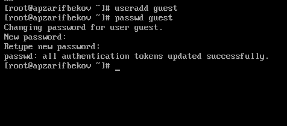
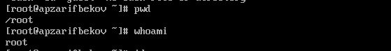
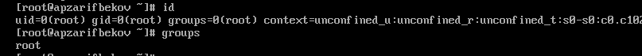
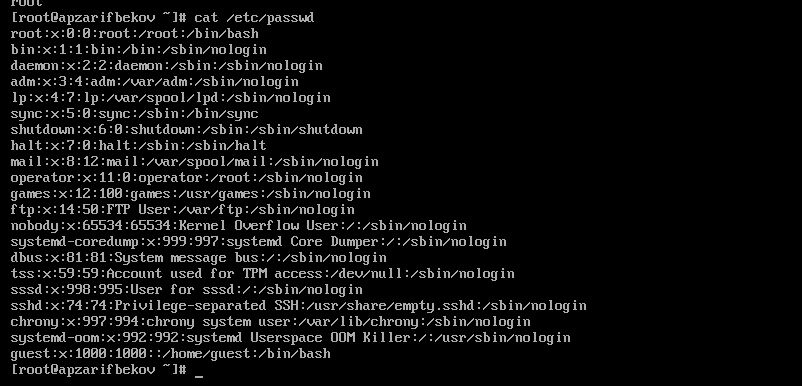
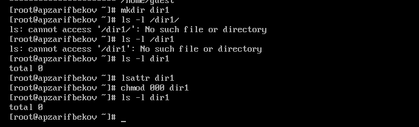
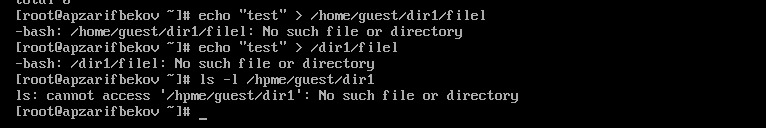

---
## Front matter
title: "Отчет № 3 по выполнению курса на онлайн платформе Stepik.org"
subtitle: "Введение в Linux. Часть 3."
author: "Басманова Дарья Кирилловна. НБИбд-01-22"

## Generic otions
lang: ru-RU
toc-title: "Содержание"

## Bibliography
bibliography: bib/cite.bib
csl: pandoc/csl/gost-r-7-0-5-2008-numeric.csl

## Pdf output format
toc: true # Table of contents
toc-depth: 2
lof: true # List of figures

fontsize: 12pt
linestretch: 1.5
papersize: a4
documentclass: scrreprt
## I18n polyglossia
polyglossia-lang:
  name: russian
  options:
	- spelling=modern
	- babelshorthands=true
polyglossia-otherlangs:
  name: english
## I18n babel
babel-lang: russian
babel-otherlangs: english
## Fonts
mainfont: PT Serif
romanfont: PT Serif
sansfont: PT Sans
monofont: PT Mono
mainfontoptions: Ligatures=TeX
romanfontoptions: Ligatures=TeX
sansfontoptions: Ligatures=TeX,Scale=MatchLowercase
monofontoptions: Scale=MatchLowercase,Scale=0.9
## Biblatex
biblatex: true
biblio-style: "gost-numeric"
biblatexoptions:
  - parentracker=true
  - backend=biber
  - hyperref=auto
  - language=auto
  - autolang=other*
  - citestyle=gost-numeric
## Pandoc-crossref LaTeX customization
figureTitle: "Рис."
tableTitle: "Таблица"
listingTitle: "Листинг"
lofTitle: "Список иллюстраций"
lotTitle: "Список таблиц"
lolTitle: "Листинги"
## Misc options
indent: true
header-includes:
  - \usepackage{indentfirst}
  - \usepackage{float} # keep figures where there are in the text
  - \floatplacement{figure}{H} # keep figures where there are in the text
---

# Цель работы

	Целью третьего блока "Продвинутые темы" является:
 
1. Научиться работать с редактором Vim.
2. Работа в интерпретаторе bash и других приложениях.

# Задание

	Для изучения и выполнения практических заданий нам дается 7 мини-блоков в нашем большом блоке "Продвинутые темы". Нам нужно просмотреть теоретические видео и выполнить тестовые задания. 

# Теоретическое введение

	Мы будем работать в гораздо более мощном редакторе vim. Он позволяет выполнять многие действия на уровне продвинутых редакторов с графическим пользовательским интерфейсом или даже лучше. Кроме того, vim (или, как минимум, его "старший брат" vi), в отличие от nano и многих других программ, по умолчанию установлен в подавляющем большинстве дистрибутивов Linux (и не только Linux!), поэтому научившись им пользоваться, мы сможем отредактировать текстовые файлы практически в любом терминале на любой системе. Это особенно актуально, когда у нас нет возможности запустить редактор с графическим пользовательским интерфейсом, например, если вы находитесь на сервере.

# Выполнение заданий Stepik. Работа на сервисе.

Описываются проведённые действия, в качестве иллюстрации даётся ссылка на иллюстрацию (рис. @fig:001).

	Для начала мы додлжны изучить, что такое vim и зачем на нем работать. 

	Первый вопрос в блоке **"Текстовый редактор vim":**
	
	Какую клавишу(и) нужно нажать на клавиатуре, чтобы выйти из редактора vim? Считайте, что вы только что открыли файл и вам сразу понадобилось выйти из редактора.

{#fig:001 width=70%}

Описываются проведённые действия, в качестве иллюстрации даётся ссылка на иллюстрацию (рис. @fig:002).

	При перемещении в vim "по словам" есть небольшая разница в том, используем мы маленькую (w, e, b) или большую (W, E, B) букву. Первые перемещают нас по "словам" (word), а вторые по "большим словам" (WORD). Посмотрите справку по этим перемещениям и разберитесь в чем заключается разница между word и WORD.
	
А для того, чтобы убедиться, что вы разобрались, отметьте ниже все верные утверждения про следующую строку:
Strange_  TEXT  is_here. 2=2 YES!

{#fig:002 width=70%} 

Описываются проведённые действия, в качестве иллюстрации даётся ссылка на иллюстрацию (рис. @fig:003).

	
	Предположим, что в текстовом файле записана одна единственная строка:
one two three four five
и вам нужно преобразовать её в строку
three four four four five

	Какие(ой) из предложенных ниже наборов нажатий клавиш выполнят такое редактирование? В этих наборах нажатие на клавишу Esc обозначается как <Esc> (т.е. знаки "<" и ">" не несут отдельного смысла).

{#fig:003 width=70%} 

Описываются проведённые действия, в качестве иллюстрации даётся ссылка на иллюстрацию (рис. @fig:004).

	Предположим, что вы открыли файл в редакторе vim и хотите заменить в этом файле все строки, содержащие слово Windows, на такие же строки, но со словом Linux. Если в какой-то строке слово Windows встречается больше, чем один раз, то заменить на Linux в этой строке нужно только самое первое из этих слов.

{#fig:004 width=70%} 

Описываются проведённые действия, в качестве иллюстрации даётся ссылка на иллюстрацию (рис. @fig:005).

	Третий режим работы vim - режим выделения (Visual).

Чтобы убедиться, что вы разобрались с этим режимом работы, отметьте, пожалуйста, все верные утверждения из списка ниже.

{#fig:005 width=70%} 

Описываются проведённые действия, в качестве иллюстрации даётся ссылка на иллюстрацию (рис. @fig:006).

	Практическое задание в терминале: Откройте в vim файл /home/box/byron.txt. Удалите все строки с 1001 по 2000 (включительно). Скопируйте строки с 5 по 11 (включительно) и вставьте их в самый конец файла, добавив одну пустую строку перед этой вставкой (т.е. строчка 5 должна следовать за ровно одной пустой строкой, а та за строкой с номером 6277). Замените в тексте все "Harold" на "Ivan".

Сохраните отредактированный файл с именем /home/box/byron_edited.txt (это можно сделать прямо из vim!).

	Выполнение:

{#fig:006 width=70%} 

Описываются проведённые действия, в качестве иллюстрации даётся ссылка на иллюстрацию (рис. @fig:007).

Переходим к следующему мини-блоку **"Скрипты на bash"**. После изучения теории решаем три тестовых задания и одно практическое

	Что такое программирование вообще и что такое bash. Затем перейдем и к практической части - посмотрим, что должна включать в себя программа (скрипт) на bash, напишем первый простой скрипт и запустим его в терминале. Рассмотрим и попробуем на практике такие понятия как переменные и аргументы скрипта.

	Надеемся, что вы разобрались, что одну оболочку (например, sh) можно запустить из другой оболочки (например, из bash).

	Предположим, что вы открыли терминал и у вас в нем запущена оболочка bash. Вы набираете в ней команды А1, А2, А3, а затем запускаете оболочку sh. В этой оболочке вы набираете команды B1, В2, В3 и запускаете оболочку bash. И, наконец, в этой последней оболочке вы набираете команды С1, С2, С3. Если теперь вы попробуете при помощи стрелочек вверх/вниз перемещаться по истории набранных команд, то команды из какого набора(ов) будут появляться?

{#fig:007 width=70%} 

Описываются проведённые действия, в качестве иллюстрации даётся ссылка на иллюстрацию (рис. @fig:008).

Вы можете скачать и изучить скрипты, которые мы показали в видеофрагменте: script1.sh, script2.sh.

Предположим, что вы находитесь в директории /home/bi/Documents/ и запускаете в ней скрипт следующего содержания:

!/bin/bash

cd /home/bi/
touch file1.txt
cd /home/bi/Desktop/

Как будет выглядеть абсолютный путь до созданного файла file1.txt по окончанию работы скрипта?
	

{#fig:008 width=70%} 

Описываются проведённые действия, в качестве иллюстрации даётся ссылка на иллюстрацию (рис. @fig:009).

Какие из представленных ниже строк могут быть именами переменных в bash? 

{#fig:009 width=70%} 

Описываются проведённые действия, в качестве иллюстрации даётся ссылка на иллюстрацию (рис. @fig:011).

Напишите скрипт на bash, который принимает на вход два аргумента и выводит на экран строку следующего вида:

Arguments are: $1=первый_аргумент $2=второй_аргумент

Например, если ваш скрипт называется ./script.sh, то при запуске его ./script.sh one two на экране должно появиться:

Arguments are: $1=one $2=two

а при запуске ./script.sh three four будет:

Arguments are: $1=three $2=four

{#fig:010 width=70%} 

	Однако такое поведение подходит далеко не всегда. Мы изучим управляющие конструкции языка bash, которые позволят нам писать скрипты, где часть инструкций выполняется только при определенных условиях (ветвления), а часть инструкций выполняется по много раз подряд (циклы).. В мини-блок **"Скрипты на bash: ветвления и циклы"** рассмотрим управляющие конструкции.
	
Описываются проведённые действия, в качестве иллюстрации даётся ссылка на иллюстрацию (рис. @fig:012).

	Предположим, вы пишете скрипт на bash и хотите использовать в нем конструкцию if в следующем фрагменте:

if [[ ... ]]
then
  echo "True"
fi

Вы можете вписать вместо "..." (внутри [[ ]] и не забудьте про пробелы после [[ и перед ]]!) любое из перечисленных ниже условий. Однако мы просим вас выбрать только те из них, при которых echo напечатает на экран True вне зависимости от того, с какими параметрами был запущен ваш скрипт и какие в нем есть переменные.

Например, условие 0 -eq 0 подходит, т.к. ноль всегда равен нулю вне зависимости от аргументов и переменных внутри скрипта и на экран будет напечатано True.  В то же время условие $var1 -eq 0 не подходит, так как в переменной var1 как может быть записан ноль (тогда будет напечатано True), так его может и не быть (тогда ничего напечатано не будет).
{#fig:012 width=70%} 

Описываются проведённые действия, в качестве иллюстрации даётся ссылка на иллюстрацию (рис. @fig:013).

	Вы можете скачать и изучить скрипты, которые мы показали в видеофрагменте: branching2.sh, branching3.sh.

Посмотрите на фрагмент bash-скрипта:

if [[ $var -gt 5 ]]
then
  echo "one" 
elif [[ $var -lt 3 ]]
then
  echo "two"
elif [[ $var -eq 4 ]]
then
  echo "three"
else
  echo "four"
fi

Какие строки и в какой последовательности он выведет на экран, если сначала этот скрипт запустили задав переменную var=3, а затем запустили еще раз, но уже с var=5.

{#fig:013 width=70%} 

Описываются проведённые действия, в качестве иллюстрации даётся ссылка на иллюстрацию (рис. @fig:015).

	Вы можете скачать и изучить скрипты, которые мы показали в видеофрагменте: loops1.sh, loops2.sh.

Посмотрите на фрагмент bash-скрипта:

for str in a , b , c_d
do
  echo "start" 
  if [[ $str > "c" ]]
  then
    continue
  fi
  echo "finish"
done

{#fig:015 width=70%} 

Описываются проведённые действия, в качестве иллюстрации даётся ссылка на иллюстрацию (рис. @fig:016).

Напишите скрипт на bash, который будет определять в какую возрастную группу попадают пользователи. При запуске скрипт должен вывести сообщение "enter your name:" и ждать от пользователя ввода имени (используйте read, чтобы прочитать его). Когда имя введено, то скрипт должен написать "enter your age:" и ждать ввода возраста (опять нужен read). Когда возраст введен, скрипт пишет на экран "<Имя>, your group is <группа>", где <группа> определяется на основе возраста по следующим правилам:

    младше либо равно 16: "child",
    от 17 до 25 (включительно): "youth",
    старше 25: "adult".

После этого скрипт опять выводит сообщение "enter your name:" и всё начинается по новой (бесконечный цикл!). Если в какой-то момент работы скрипта будет введено пустое имя или возраст 0, то скрипт должен написать на экран "bye" и закончить свою работу (выход из цикла!).

{#fig:016 width=70%} 

Описываются проведённые действия, в качестве иллюстрации даётся ссылка на иллюстрацию (рис. @fig:017).

	Следующий блок  **Скрипты на bash:** разноемы заканчиваем изучение основ программирования на bash. С использованием уже пройденного материала можно написать довольно сложные и полезные скрипты на bash, но на этом занятии будет рассмотрено еще несколько полезных тем. Среди них будут: арифметические операции;  запуск внешних программ и обработка результатов их работы; понятие функций в языке bash и их использование. 

Какие(ая) из предложенных ниже инструкций увеличат значение переменной а на значение переменной b? Например, если в а было записано 10, в b было 5, то в а должно записаться 15. 

{#fig:017 width=70%} 

Описываются проведённые действия, в качестве иллюстрации даётся ссылка на иллюстрацию (рис. @fig:018).

	Пусть вы находитесь в директории /home/bi/Documents/ и запускаете в ней скрипт следующего содержания:

!/bin/bash

cd /home/bi/
echo "`pwd`"

Что в этом случае выведет команда echo на экран?

{#fig:018 width=70%} 

Описываются проведённые действия, в качестве иллюстрации даётся ссылка на иллюстрацию (рис. @fig:019).

	Выберите все верные утверждения или правильно работающие конструкции if.

{#fig:019 width=70%} 

Описываются проведённые действия, в качестве иллюстрации даётся ссылка на иллюстрацию (рис. @fig:020).
	
	Посмотрите на функцию из bash-скрипта:

counter ()  # takes one argument
{
  local let "c1+=$1"
  let "c2+=${1}*2"
} 

Впишите в форму ниже строку, которую выведет на экран команда echo "counters are $c1 and $c2" если она находится в скрипте после десяти вызовов функции counter с параметрами сначала 1, затем 2, затем 3 и т.д., последний вызов с параметром 10.

{#fig:020 width=70%} 

Описываются проведённые действия, в качестве иллюстрации даётся ссылка на иллюстрацию (рис. @fig:021).

	Напишите скрипт на bash, который будет искать наибольший общий делитель (НОД, greatest common divisor, GCD) двух чисел. При запуске ваш скрипт не должен ничего писать на экран, а просто ждет ввода двух натуральных чисел через пробел (для этого можно использовать read и указать ему две переменные -- см. пример в видеофрагменте). После ввода чисел скрипт считает их НОД и выводит на экран сообщение "GCD is <посчитанное значение>", например, для чисел 15 и 25 это будет "GCD is 5". После этого скрипт опять входит в режим ожидания двух натуральных чисел. Если в какой-то момент работы пользователь ввел вместо этого пустую строку, то нужно написать на экран "bye" и закончить свою работу. 

Вычисление НОД несложно реализовать с помощью алгоритма Евклида. Вам нужно написать функцию gcd, которая принимает на вход два аргумента (назовем их M и N). Если аргументы равны, то мы нашли НОД -- он равен M (или N), нужно выводить соответствующее сообщение на экран (см. выше). Иначе нужно сравнить аргументы между собой. Если M больше N, то запускаем ту же функцию gcd, но в качестве первого аргумента передаем (M-N), а в качестве второго N. Если же наоборот, M меньше N, то запускаем функцию gcd с первым аргументом M, а вторым (N-M).
Пример корректной работы скрипта:

./script.sh
10 15
GCD is 5
7 3 
GCD is 1

bye

{#fig:021 width=70%}
 
Описываются проведённые действия, в качестве иллюстрации даётся ссылка на иллюстрацию (рис. @fig:022).

Напишите калькулятор на bash. При запуске ваш скрипт должен ожидать ввода пользователем команды (при этом на экран выводить ничего не нужно). Команды могут быть трех типов: 

    Слово "exit". В этом случае скрипт должен вывести на экран слово "bye" и завершить работу. 
    Три аргумента через пробел -- первый операнд (целое число), операция (одна из "+", "-", "*", "/", "%", "**") и второй операнд (целое число). В этом случае нужно произвести указанную операцию над заданными числами и вывести результат на экран. После этого переходим в режим ожидания новой команды.
    Любая другая команда из одного аргумента или из трех аргументов, но с операцией не из списка. В этом случае нужно вывести на экран слово "error" и завершить работу.

Чтобы проверить работу скрипта, вы можете записать сразу несколько команд в файл и передать его скрипту на stdin (т.е. выполнить ./script.sh < input.txt). В этом случае он должен вывести сразу все ответы на экран.
Например, если входной файл будет следующего содержания:

10 + 1
2 ** 10
exit

то на экране будет:

11
1024
bye
	

{#fig:022 width=70%} 

Описываются проведённые действия, в качестве иллюстрации даётся ссылка на иллюстрацию (рис. @fig:023).

 	Мини-блок **"Продвинутый поиск и редактирование "**. Данный блок предназначен для знакомимства с командой (точнее потоковым текстовым редактором) sed, который позволяет не только искать слова в файлах, но и сразу же эти файлы редактировать.
 
	

	Пусть в директории /home/bi лежат файлы Star_Wars.avi, star_trek_OST.mp3, STARS.txt, stardust.mpeg, Eddard_Stark_biography.txt.

	Отметьте все файлы, которые найдет команда find /home/bi -iname "star*", но НЕ найдет команда find /home/bi -name "star*"?

{#fig:023 width=70%} 

Описываются проведённые действия, в качестве иллюстрации даётся ссылка на иллюстрацию (рис. @fig:024).
	
Задание на понимание работы опций -path и -name команды find. Отметьте все верные утверждения из перечисленных ниже.

{#fig:024 width=70%} 

Описываются проведённые действия, в качестве иллюстрации даётся ссылка на иллюстрацию (рис. @fig:025).

Предположим, что в директории /home/bi/ есть следующая структура файлов и поддиректорий:

/home/bi/
└── dir1
    ├── file1 
    └── dir2
        ├── file2
        └── dir3
            └── file3

Какие(ой) из трех файлов (file1, file2, file3) будут найдены по команде find /home/bi -mindepth 2 -maxdepth 3 -name "file*"?
	

{#fig:025 width=70%} 

Описываются проведённые действия, в качестве иллюстрации даётся ссылка на иллюстрацию (рис. @fig:026).

Задание на понимание работы опций -A, -B и -C команды grep. Пусть у вас есть файл file.txt из 10 строк, причем в каждой строке есть слово "word". Если вы выполните на этом файле команды:

grep "word" file.txt > results.txt
grep -A 1 "word" file.txt > results.txt
grep -B 1 "word" file.txt > results.txt
grep -C 1 "word" file.txt > results.txt

то какая(ие) из них создаст файл results.txt наибольшего размера?
	
{#fig:026 width=70%} 

Описываются проведённые действия, в качестве иллюстрации даётся ссылка на иллюстрацию (рис. @fig:027).

	Что произойдет, если в команде sed -n "/[a-z]*/p" text.txt не указывать опцию -n?
	
{#fig:027 width=70%} 

Описываются проведённые действия, в качестве иллюстрации даётся ссылка на иллюстрацию (рис. @fig:028).

	Мини-блок **"Строим графики в gnuplot"**. Данный блок предназначен для рассмотрения программы gnuplot. Эта программа используется для построения двух- и трехмерных графиков. Мы изучим базовые команды gnuplot для работы в интерактивном режиме, а затем познакомимся с потоковым режимом работы и напишем несколько gnuplot-скриптов. В завершение занятия будут продемонстрированы некоторые из продвинутых возможностей gnuplot. 
	
	
	Вы можете скачать и попробовать применить gnuplot к файлу, который мы показали в видеофрагменте: authors.txt.

	Какую опцию нужно указать при запуске gnuplot, чтобы при его закрытии не были автоматически закрыты и все нарисованные в нём графики?

	
{#fig:028 width=70%} 

Описываются проведённые действия, в качестве иллюстрации даётся ссылка на иллюстрацию (рис. @fig:029).

	Предположим у вас есть файл data.csv с двумя столбцами по 10 чисел в каждом. В первой строке не записаны названия столбцов, т.е. ряды данных начинаются прямо с первой строки. Вы запускаете gnuplot и вводите в него две команды:

set key autotitle columnhead
plot 'data.csv' using 1:2

	Какое в этом случае будет название у построенного ряда данных и сколько будет нарисовано точек на графике?

{#fig:029 width=70%} 

Описываются проведённые действия, в качестве иллюстрации даётся ссылка на иллюстрацию (рис. @fig:030).

	Предположим, что вы пишите gnuplot-скрипт и у вас в нем есть три переменные x1, x2, x3, в которых записаны координаты важных точек по оси ОХ (по возрастанию). Вы хотите, чтобы на этой оси было только три деления (т.е. три черточки) в этих самых координатах, а подписи этих делений были оформлены в виде "point <номер точки>, value <значение соответствующей переменной>".
	Например, для x1=0, x2=10, x3=20, это были бы надписи "point 1, value 0" в точке с координатой 0 по горизонтали,  "point 2, value 10" в точке с координатой 10 и  "point 3, value 20" в точке с координатой 20.
	Или, например,  x1=100, x2=150, x3=250, это были бы надписи "point 1, value 100" в точке с координатой 100, "point 2, value 150" в точке с координатой 150 и "point 3, value 250" в точке с координатой 250. 

	Впишите в форму ниже одну команду (т.е. одну строку), которую нужно добавить в скрипт, для выполнения этой задачи.
	
{#fig:030 width=70%} 

Описываются проведённые действия, в качестве иллюстрации даётся ссылка на иллюстрацию (рис. @fig:031).

	Если вы не скачали на предыдущем шаге файлы animated.gnu и move.rot, то скачайте их теперь, т.к. они понадобятся для выполнения задания. 

Указанные файлы использовались в последнем видеофрагменте для создания вращающегося графика. Измените инструкции в файле move.rot (т.е. добавлять и удалять инструкции нельзя!) таким образом, чтобы:

    График отразился зеркально относительно горизонтальной поверхности. То есть там, где была точка (10, 10, 200), станет точка (10, 10, -200), где была точка  (-10, -10, 200) станет (-10, -10, -200) и т.д. При этом точка (0, 0, 0) останется на месте.
    Изображение стало вращаться в обратную сторону. То есть если раньше вращалось "влево", то теперь станет "вправо".
    Вращение стало в два раза быстрее. То есть станет в два раза больше перерисовок графика на каждую секунду вращения.

     Измененный файл загрузите в форму ниже.
	
	
{#fig:031 width=70%} 

Описываются проведённые действия, в качестве иллюстрации даётся ссылка на иллюстрацию (рис. @fig:032).

В этом блоке **Разное** мы рассмотрим несколько небольших, но довольно важных тем. Эти моменты не вошли в другие занятия курса, но мы считаем важным упомянуть о них хотя бы на завершающем занятии. 

Сначала мы обсудим понятие прав доступа в Linux, затем изучим несколько новых команд терминала, а напоследок рассмотрим несколько новых возможностей применения уже известных нам команд. 
	
	Какая команда(ы) установят файлу file.txt права доступа rwxrw-r--, если изначально у него были права r--r--r--. Укажите все верные варианты ответа!
	
{#fig:032 width=70%} 

Описываются проведённые действия, в качестве иллюстрации даётся ссылка на иллюстрацию (рис. @fig:033).

	Предположим вы использовали команду sudo для создания директории dir. По умолчанию для dir были выставлены права доступа rwxr-xr-x (владелец root, группа root). Таким образом никто кроме пользователя root не может ничего записывать в эту директорию, например, не может создавать файлы в ней. 

	После выполнения какой команды user из группы group всё-таки сможет создать файл внутри dir? Укажите все верные варианты ответов!
	
{#fig:033 width=70%} 

Описываются проведённые действия, в качестве иллюстрации даётся ссылка на иллюстрацию (рис. @fig:034).

	Отметьте какие характеристики файла можно посчитать с использованием команды wc.

{#fig:034 width=70%} 

Описываются проведённые действия, в качестве иллюстрации даётся ссылка на иллюстрацию (рис. @fig:035).

	Впишите в форму ниже команду, которая выведет сколько места на диске занимает текущая директория (при этом размер нужно вывести в удобном для чтения формате (например, вместо 2048 байт надо выводить 2.0К) и больше на экран выводить ничего не нужно). 

{#fig:035 width=70%}

Описываются проведённые действия, в качестве иллюстрации даётся ссылка на иллюстрацию (рис. @fig:036).

	Впишите в форму ниже максимально короткую команду (т.е. в которой минимально возможное число символов), которая позволит создать в текущей директории 3 поддиректории с именами dir1, dir2, dir3. 

{#fig:036 width=70%}

# Выводы

	Курс знакомит слушателей с операционной системой Linux и основами её использования. В рамках третьего заключительного блока курса мы научились работать на редакторе Vim, интерпретаторе bash и других приложениях. 

# Используемые ресурсы

**Введение в Linux** https://stepik.org/course/73

