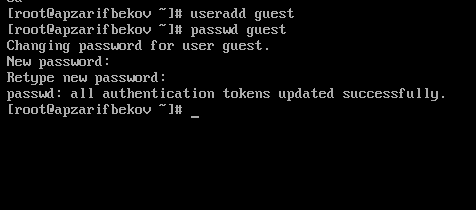
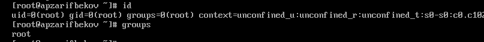
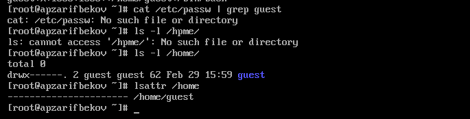
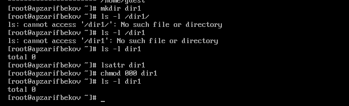
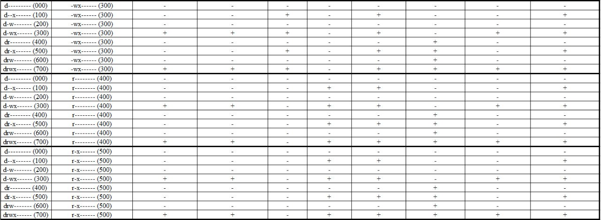

---
## Front matter
title: "Лабораторная работа № 2"
subtitle: "Основы информационной безопасности"
author: "Зарифбеков Амир "

## Generic otions
lang: ru-RU
toc-title: "Содержание"

## Bibliography
bibliography: bib/cite.bib
csl: pandoc/csl/gost-r-7-0-5-2008-numeric.csl

## Pdf output format
toc: true # Table of contents
toc-depth: 2
lof: true # List of figures
lot: true # List of tables
fontsize: 12pt
linestretch: 1.5
papersize: a4
documentclass: scrreprt
## I18n polyglossia
polyglossia-lang:
  name: russian
  options:
	- spelling=modern
	- babelshorthands=true
polyglossia-otherlangs:
  name: english
## I18n babel
babel-lang: russian
babel-otherlangs: english
## Fonts
mainfont: PT Serif
romanfont: PT Serif
sansfont: PT Sans
monofont: PT Mono
mainfontoptions: Ligatures=TeX
romanfontoptions: Ligatures=TeX
sansfontoptions: Ligatures=TeX,Scale=MatchLowercase
monofontoptions: Scale=MatchLowercase,Scale=0.9
## Biblatex
biblatex: true
biblio-style: "gost-numeric"
biblatexoptions:
  - parentracker=true
  - backend=biber
  - hyperref=auto
  - language=auto
  - autolang=other*
  - citestyle=gost-numeric
## Pandoc-crossref LaTeX customization
figureTitle: "Рис."
tableTitle: "Таблица"
listingTitle: "Листинг"
lofTitle: "Список иллюстраций"
lotTitle: "Список таблиц"
lolTitle: "Листинги"
## Misc options
indent: true
header-includes:
  - \usepackage{indentfirst}
  - \usepackage{float} # keep figures where there are in the text
  - \floatplacement{figure}{H} # keep figures where there are in the text
---

# Цель работы

Получение практических навыков работы в консоли с атрибутами файлов, закрепление теоретических основ дискреционного разграничения доступа в современных системах с открытым кодом на базе ОС Linux1

# Выполнение лабораторной работы

1. в установленной на предедушей паре операционной системе сохдадим учётную запись guest. Зададим пароль для пользователя guest

{#fig 001 width=70%}

2. Зайдём в систему от имени guest. определим директорию, в которой мы находимся, командой pwdю сравним её с приглашением командной строки. определим, является ли она нашей домашней директорей . уточним имя пользователя командой whoami.

{#fig:002 width=70%}

3. Уточним имя нашего пользователя , его группу, а также группы, куда входит пользователь , командой id. 

{#fig:6 width=70%}

4.  Просмотрим  файл /etc/passwd командойcat /etc/passwd Найдём  в нём свою учётную запись. Определим  uid пользователя. Определим gid пользователя. Сравним найденные значения с полученными в предыдущих пунктах.

{#fig:8 width=70%}

5. Определим  существующие в системе директории командойls -l /home/

{#fig:009 width=70%}

6. Проверим , какие расширенные атрибуты установлены на поддиректориях, находящихся в директории /home, командой:lsattr /home. Создадим в домашней директории поддиректорию dir1 командой mkdir dir1

{#fig:010 width=70%}

7. Снимим  с директории dir1 все атрибуты командой chmod 000 dir1 и проверим с её помощью правильность выполнения команды ls -l. Попытаемся  создать в директории dir1 файл file1 командой
echo "test" > /home/guest/dir1/file1

{#fig:012 width=70%}

8. Заполним  таблицу «Установленные права и разрешённые действия», выполняя действия от имени владельца директории (фай-лов), определив опытным путём, какие операции разрешены, а какие нет.
Если операция разрешена, занесём в таблицу знак «+», если не разрешена, знак «-».

{#fig:014 width=70%} 

{#fig:015 width=70%} 

{#fig:016 width=70%} 

9. На основании заполненной таблицы определим те или иные минимально необходимые права для выполнения операций внутри директории dir1

{#fig:016 width=70%} 
 
# Выводы

Получили практические навыки работы в консоли с атрибутами файлов, закрепили теоретические основы дискреционного разграничения доступа в современных системах с открытым кодом на базе ОС Linux1

# Список литературы{.unnumbered}

::: {#refs}
:::
