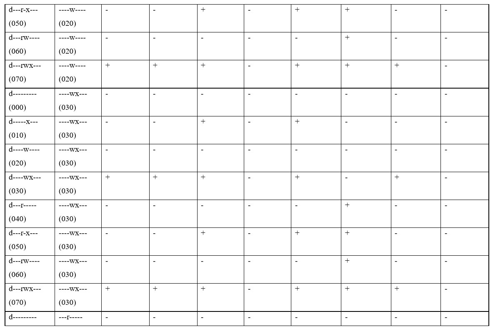

---
## Front matter
title: "Лабораторная работа № 3 Дискреционное разграничение прав в Linux. Два пользователя"
subtitle: "Основы информационной безопасности"
author: "Зарифбеков Амир "

## Generic otions
lang: ru-RU
toc-title: "Содержание"

## Bibliography
bibliography: bib/cite.bib
csl: pandoc/csl/gost-r-7-0-5-2008-numeric.csl

## Pdf output format
toc: true # Table of contents
toc-depth: 2
lof: true # List of figures
lot: true # List of tables
fontsize: 12pt
linestretch: 1.5
papersize: a4
documentclass: scrreprt
## I18n polyglossia
polyglossia-lang:
  name: russian
  options:
	- spelling=modern
	- babelshorthands=true
polyglossia-otherlangs:
  name: english
## I18n babel
babel-lang: russian
babel-otherlangs: english
## Fonts
mainfont: PT Serif
romanfont: PT Serif
sansfont: PT Sans
monofont: PT Mono
mainfontoptions: Ligatures=TeX
romanfontoptions: Ligatures=TeX
sansfontoptions: Ligatures=TeX,Scale=MatchLowercase
monofontoptions: Scale=MatchLowercase,Scale=0.9
## Biblatex
biblatex: true
biblio-style: "gost-numeric"
biblatexoptions:
  - parentracker=true
  - backend=biber
  - hyperref=auto
  - language=auto
  - autolang=other*
  - citestyle=gost-numeric
## Pandoc-crossref LaTeX customization
figureTitle: "Рис."
tableTitle: "Таблица"
listingTitle: "Листинг"
lofTitle: "Список иллюстраций"
lotTitle: "Список таблиц"
lolTitle: "Листинги"
## Misc options
indent: true
header-includes:
  - \usepackage{indentfirst}
  - \usepackage{float} # keep figures where there are in the text
  - \floatplacement{figure}{H} # keep figures where there are in the text
---

# Цель работы

Получение практических навыков работы в консоли с атрибутами файлов для групп пользователей

# Выполнение лабораторной работы

1. в установленной на предедушей паре операционной системе  создадаим учётную запись guest. Зададим пароль для пользователя guest

{#fig 001 width=70%}

2. тоже самое мы делаем для guest2, и так же задаём пароль для guest2

{#fig:002 width=70%}

3. Добавим пользователя guest2 в группу guest

{#fig:003 width=70%}

4.  Осуществляю  вход в систему от имени guest. Для  guest  командой pwd опредлю директорию, в кото-
рой мы  находимся. Сравним её с приглашениями командной строки. Уточним имя своего пользователя, его группу, кто входит в неё и к каким группам принадлежит он сам. Определяю  командами
groups guest , в какие группы входит пользователь guest Сравните вывод команды groups с выводом команд id -Gn и id -G. Сравниваю  полученную информацию с содержимым файла /etc/group.
Просмотрите файл командой cat /etc/group

{#fig:004 width=70%}

5. Осуществляю  вход в систему от имени guest. Для  guest2  командой pwd опредлю директорию, в кото-
рой мы  находимся. Сравним её с приглашениями командной строки. Уточним имя своего пользователя, его группу, кто входит в неё и к каким группам принадлежит он сам. Определяю  командами
groups guest2, в какие группы входит пользователь guest2 Сравните вывод команды groups с выводом команд id -Gn и id -G. Сравниваю  полученную информацию с содержимым файла /etc/group.
Просмотрите файл командой cat /etc/group 

{#fig:005 width=70%}

6. От имени пользователя guest2 выполняю регистрацию пользователя guest2 в группе guest командой 

{#fig:006 width=70%}

7. От имени пользователя guest изменяю права директории /home/guest,разрешив все действия для пользователей групы. От имени пользователя guest снимаю  с директории /home/guest/dir1
все атрибуты командой chmod 000 dir

{#fig:007 width=70%}

8. Меняю атрибуты у директории dir1 и файла file1 от имени пользователя guest и делая проверку от пользователя guest2, заполняю табл. 3.1,определив опытным путём, какие операции разрешены, а какие нет.Заношу в таблицу знак «+», если не разрешена,
знак «-».Сравниваю табл. 2.1 (из лабораторной работы № 2) и табл. 3.1.На основании заполненной таблицы определяю  те или иные минимально необходимые права для выполнения пользователем guest2 операцийвнутри директории dir1 и заполните табл. 3.2.

{#fig:008 width=70%} 

{#fig:009 width=70%} 

{#fig:010 width=70%} 

{#fig:011 width=70%} 

{#fig:012 width=70%} 

{#fig:013 width=70%} 

# Выводы

Получил практические навыки работы в консоли с атрибутами файлов для групп пользователей

# Список литературы{.unnumbered}

::: {#refs}
:::
